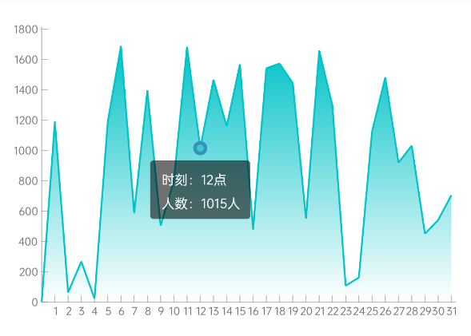
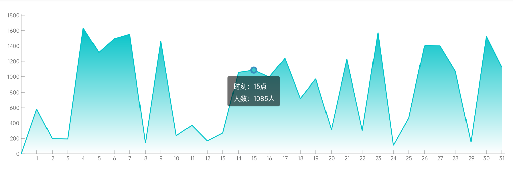

# LineChartView
折线统计图、点击显示面板（标签|值）
# 预览

竖屏效果  

横屏屏效果  


# 资源

|名字|资源| |-|-|
|AAR|[line_chart_view.aar](https://github.com/RelinRan/LineChartView/blob/master/line_chart_view_2022.7.22.1)|
|GitHub |[LineChartView](https://github.com/RelinRan/LineChartView)|
|Gitee|[LineChartView](https://gitee.com/relin/LineChartView)|

# Maven

1.build.grade | setting.grade

```
repositories {
	...
	maven { url 'https://jitpack.io' }
}
```

2./app/build.grade

```
dependencies {
	implementation 'com.github.RelinRan:LineChartView:2022.7.22.1'
}
```

# xml

~~~
<androidx.widget.LineChartView
    android:id="@+id/line_chart"
    android:layout_width="match_parent"
    android:layout_height="300dp"
    app:descriptionXName="日期"
    app:descriptionXUnit="天"
    app:descriptionYName="人数"
    app:descriptionYUnit="人"
    app:simulationData="true"
    app:tickMarkHorizontalCount="31"
    app:tickMarkVerticalCount="10"
    app:unitVerticalTickMarkValue="200" />
~~~

# attrs.xml

~~~
<!--模拟数据-->
<attr name="simulationData" format="boolean" />
<!--线条颜色-->
<attr name="markLineColor" format="color" />
<!--线条宽度-->
<attr name="markLineStrokeWidth" format="dimension" />
<!--字体颜色-->
<attr name="markTextColor" format="color" />
<!--字体大小-->
<attr name="markTextSize" format="dimension" />
<!--折现颜色-->
<attr name="chartLintColor" format="color" />
<!--折现填充颜色-->
<attr name="chartLintSolidColor" format="color" />
<!--折现宽度-->
<attr name="chartLineStrokeWidth" format="dimension" />
<!--刻度线左边间距-->
<attr name="tickMarkMarginLeft" format="dimension" />
<!--刻度线文字间距-->
<attr name="tickMarkTextMargin" format="dimension" />
<!--刻度线底部间距-->
<attr name="tickMarkMarginBottom" format="dimension" />
<!--刻度线右边间距-->
<attr name="tickMarkMarginRight" format="dimension" />
<!--刻度值宽度-->
<attr name="tickMarkWH" format="dimension" />
<!--刻度线（垂直）段数-->
<attr name="tickMarkVerticalCount" format="integer" />
<!--刻度线（水平）段数-->
<attr name="tickMarkHorizontalCount" format="integer" />
<!--垂直单位刻度值-->
<attr name="unitVerticalTickMarkValue" format="integer" />
<!--水平单位刻度值-->
<attr name="unitHorizontalTickMarkValue" format="integer" />
<!--水平刻度开始值-->
<attr name="horizontalTickMarkStartValue" format="integer" />
<!--点击范围-->
<attr name="coordinateDownRange" format="dimension" />
<!--圆点半径-->
<attr name="circleRadius" format="dimension" />
<!--圆点外圈间距-->
<attr name="circleStrokeWidth" format="dimension" />
<!--圆点外圈颜色-->
<attr name="circleStrokeColor" format="color" />
<!--圆点填充颜色-->
<attr name="circleSolidColor" format="color" />
<!--描述信息背景颜色-->
<attr name="descriptionBackgroundColor" format="color" />
<!--描述信息背景圆角大小-->
<attr name="descriptionBackgroundRadius" format="dimension" />
<!--描述信息背景圆角大小-->
<attr name="descriptionTextSize" format="dimension" />
<!--描述信息文字垂直间距-->
<attr name="descriptionTextSpace" format="dimension" />
<!--描述信息文字颜色-->
<attr name="descriptionTextColor" format="color" />
<!--描述信息面板宽度-->
<attr name="descriptionWidth" format="dimension" />
<!--描述信息面板高度-->
<attr name="descriptionHeight" format="dimension" />
<!--描述信息面板距离上方间距-->
<attr name="descriptionMarginTop" format="dimension" />
<!--描述信息面板 - x轴名称-->
<attr name="descriptionXName" format="string" />
<!--描述信息面板 - x轴单位-->
<attr name="descriptionXUnit" format="string" />
<!--描述信息面板 - y轴名称-->
<attr name="descriptionYName" format="string" />
<!--描述信息面板 - y轴单位-->
<attr name="descriptionYUnit" format="string" />
~~~

# 使用

~~~
LineChartView line_chart = findViewById(R.id.line_chart);
//数据源
List<Double> data = new ArrayList<>();
for (int i = 0; i < 31; i++) {
    double value = 1 + new Random().nextInt(1800);
    data.add(value);
}
line_chart.setDatasource(data);
//点击事件
line_chart.setOnLineChartPolylineClickListener((v, polyline) -> {

});
~~~
